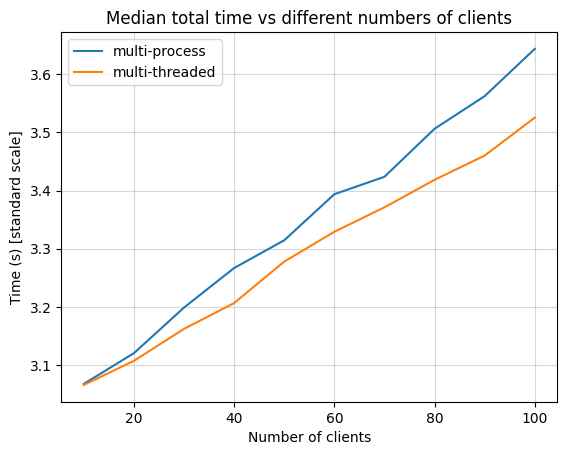
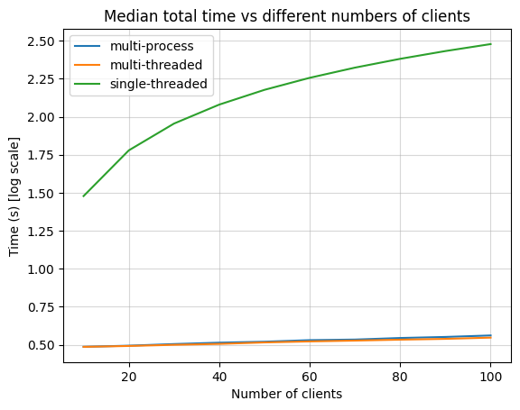

# cs331_cn

## Tutorial 1

### Running Part 1: `q1` directory

Run the following two commands in two separate terminals. Close the server program using `Ctrl + C`
```
python3 server.py
```

```
python3 client.py
```

### Running Part 2: `q2` directory

Run the following two commands in two separate terminals. Close the server program using `Ctrl + C`
```
python3 server.py <OPTIONAL: mode>
```

```
bash analyze.sh <MANDATORY: mode>
```
`mode`: {single, multi-threaded, multi-process}

Results will be stored in `analyze_<mode>.csv`

### Results





